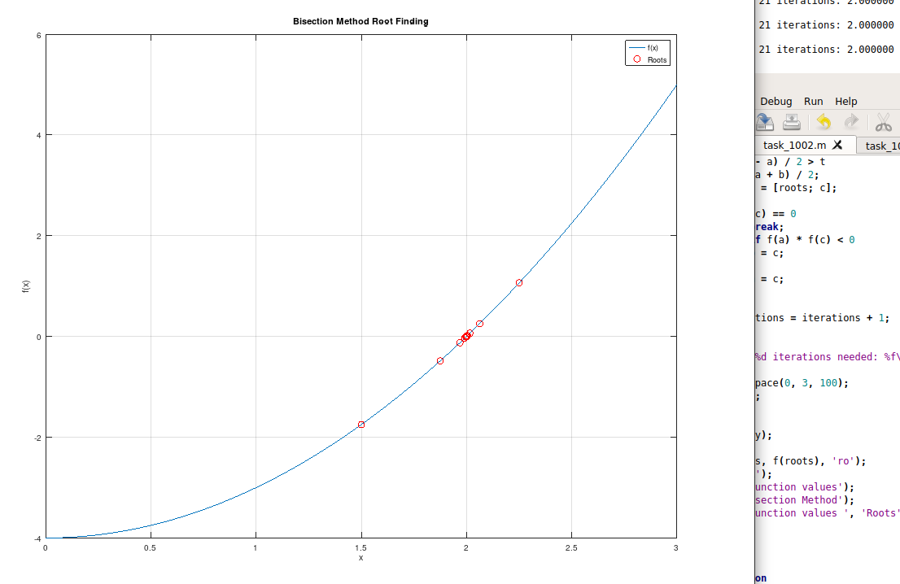
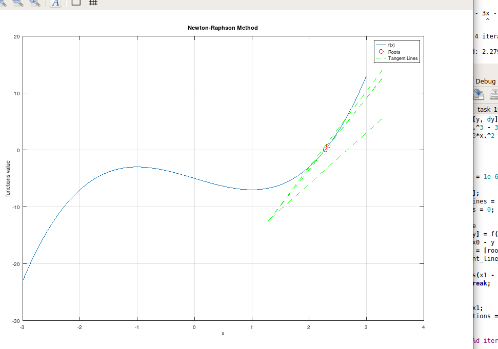
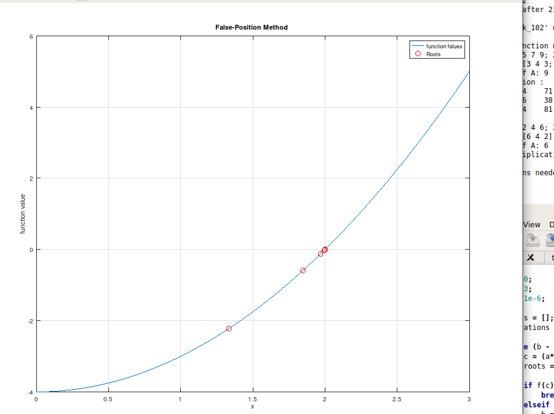
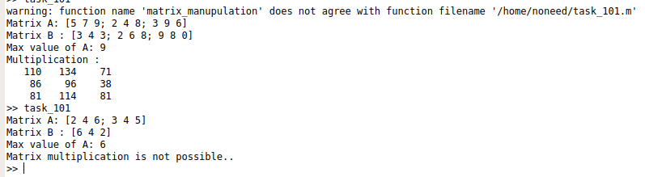

# Numerical-Analysis-Lab

This repository contains code and materials related to the Numerical Analysis Lab, including matrix manipulation and three root-finding methods: Bisection Method, Newton-Raphson Method, and False Position Method. 
You can find detailed information and code examples for each method in the respective folders.

## Contents

1. task_101 : Matrix Manupulation 

2. task_1002: Implementations of Bisection Method for finding roots of equations.

3. task_103: Implementations and examples of the False Position Method (Regula Falsi) for finding roots of equations.
   
4. task_104: Implementations of the Newton-Raphson Method for finding roots of equations. **Tangent lines are drawn at each iteration**.

## Screenshot

Here are screenshots of the plotted figures for each of the root-finding methods:

1. Bisection Method
   

2. Newton-Raphson Method
   

3. False Position Method
   

4. Matrix Manupulation
   

